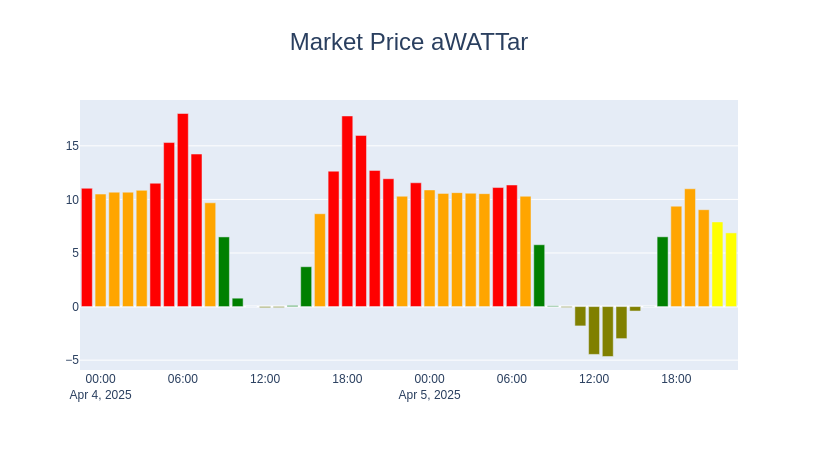

# Electricity monitor

Slim Django application for interactive electricity pricing monitor. Evaluates pricing on basis of daily mean, running averages and direct value.

## Setup
- conda environment
- django application on bootstrap basis
- inits with access tokens and configs in "static_files" 
